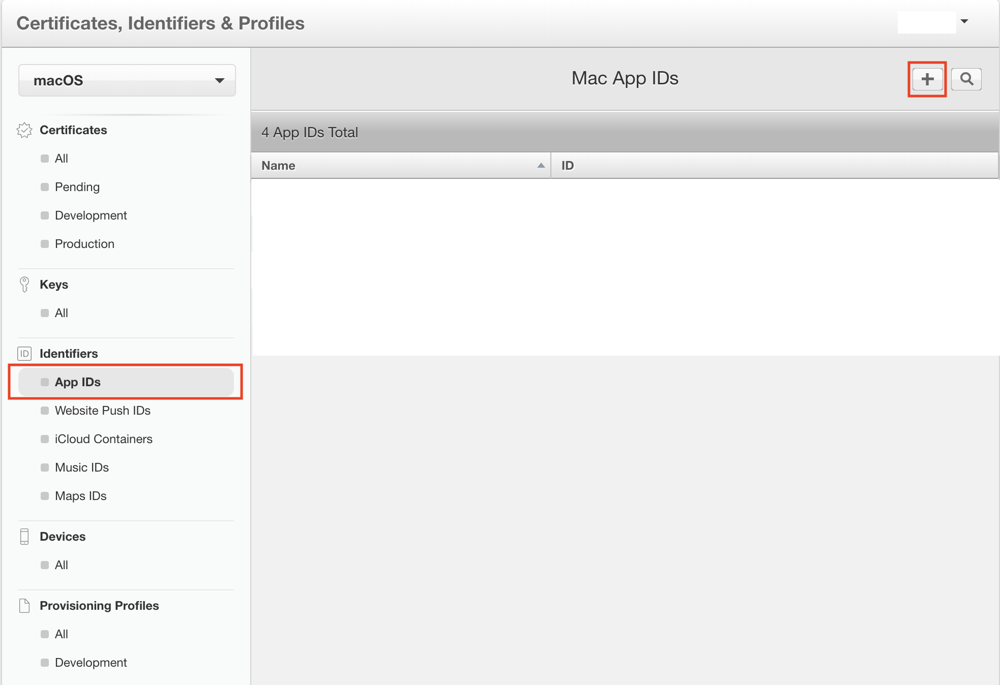

# Mac OS で Electron の autoUpdate をするために証明書をとってリリースする方法

まずは、証明書について

## コードサイニング証明書って？

オンラインで配布するソフトウェアに**デジタル署名**を行う電子署名用の証明書


👆コードサイニング証明書で署名されていないソフトウェアは改ざんを受けている可能性があるため、インストール時に警告が表示される


## デジタル署名を行うメリット

 + ソフトウェアの開発元・配布元を明確に証明
 + なりすまし、内容の改ざんされていないことを保証
 + 正規の配布元であることを証明することにより、ソフトウェアのインストール率増加

## デジタル署名がされていないソフトウェアのリスク

 + 配布元のなりすまし
 + プログラムが改ざんされている
 + マルウェア（ウイルス）が仕込まれている

## 署名と検証の仕組み

### 署名（開発側の処理）


1. コードサイニング証明書取得
1. オリジナルコード（＝ソフトウェアのプログラムデータ）から、ハッシュ値を生成
1. コードサイニング証明書の秘密鍵でハッシュ値を暗号化 **👈これがデジタル署名**
1. `オリジナルコード`, `暗号化されたハッシュ値（デジタル署名）`, `コードサイニング証明書` この3つをまとめて、パッケージを作成

#### ハッシュ値とは

データから算出される数字のこと。SHA-1、SHA256（SHA-2）等のハッシュ関数を使って算出する

元のデータが少しでも異なれば異なるハッシュ値が算出されるため

ファイルが改ざんされていないかを確認するために使うことができる

例として、Mac では sample.txt ファイルのハッシュ値を以下コマンドで取得できる

```
$ openssl sha1 sample.txt
SHA1(sample.txt)= fbe5aefc2fcbf125965974a476523b56baf632e1
```

`fbe5aefc2fcbf125965974a476523b56baf632e1` が実際のハッシュ値である

### 検証（ユーザー側の処理）


1. 証明書の有効性の確認と公開鍵の取得
1. `コード` `暗号化されたハッシュ値（デジタル署名）` に分離
1. `暗号化されたハッシュ値（デジタル署名）` を公開鍵で復号し証明書に含まれている`ハッシュ値`を取得
1. ダウンロードしたコードのハッシュ値を生成
1. **二つのハッシュ値が一致** していればコードは改竄がなく、真正であることが証明される


## Electron で autoUpdate をする方法

### 1. Githubリポジトリが Public の場合

　[update.electronjs.org](https://github.com/electron/update.electronjs.org) を使う

　ビルドコードは、コード証明されている必要があり、以下のような更新サーバーを別途用意する必要がある

  + Hazel
  + Nuts
  + electron-release-server
  + Nucleus

### 2. Githubリポジトリが Private の場合

　`electron-builder` の module [electron-updater](https://www.electron.build/auto-update) を使う

　**更新サーバーを必要とせず**、S3、GitHub、またはその他の静的ファイルホストからの更新が可能


👉 今回は  `2. Githubリポジトリが Private の場合` なので [electron-updater](https://www.electron.build/auto-update) を使うことにします


## autoUpdate するにあたり Electron で証明証が必要かどうか

### Mac: **必要**

Apple Developer Program に登録して証明書を発行する必要がある

### Windows: **不要**

Windowsストア経由にしない場合は、不要


## Mac Apple Store (=MAS) 用に Electron の証明証を取得してみる

証明証は2種類ある

1. Development 証明証

  開発用にビルドするときに使う

1. Production 証明証

  本番で、Apple Store 公開するときに使う

今回は Development 証明証を取得してみます

必要な証明証は以下の2つ

  1. **Certificates** （サーティフィケイツ）

　　開発者登録用の証明書

　　`Certificates` をキーチェーンアクセスに登録したPCでないとビルド出来ないようになっている、詳しくは後述します

　　拡張子は `.cer`

  2. **Provisioning Profile** （プロビジョニング プロファイル）

　　`Certificates` `Devices` `App ID` を合わせて作られたもの

　　ソフトウェアの開発者・販売者を、提供元のアップルに証明してもらうためのもの

　　拡張子は `.mobileprovision`


### 1. Certificates を取得する

`Certificates` を取得するために

 `CertificateSigningRequest.certSigningRequest` ファイルが必要になる

キーチェーンアクセス → 証明書アシスタント → 認証局に証明書を要求


ローカルに `CertificateSigningRequest.certSigningRequest` ファイルが保存される


次に、このファイルを使って `Certificates` を取得する

まず、`Apple Developer Program` に登録します（ $100 / Year )

登録後以下のURLからサインインします

https://developer.apple.com/account/

`Certificates, IDs & Profiles` → 左上プルダウンは `macOS` → `Certificates` 項目の `Development` → 右上 `+` マーク


`Mac Development` を選択し、進めていく

ここで、先ほど作成した `CertificateSigningRequest.certSigningRequest` ファイルをアップロードする

最後に生成された `Certificates` をダウンロードする


これを実行すると、キーチェーンに証明証が追加され、完了


### Electron Builder でビルド時に表示されるコンソールがこのように変わればOK

▼ `Certificates` インストール前


▼ `Certificates` インストール後


このように、キーチェーンに登録されている `Certificates` を Electron Builder がビルド時に自動的に見にいくようになっている

### 2. Provisioning Profile を取得する

`Provisioning Profile` を取得するために、 `App ID` を新規登録する必要があります

`App ID` とは、アプリケーションを識別するために使われ、プロファイルを作成するのに必要。

その`App ID` を新規登録する際に、`Bundle ID（バンドルID）` を決める必要がある

`Bundle ID`とはアプリケーションを識別するために使われ、ユニークである必要がある（既に Apple Store でリリースされているアプリケーションと被ってはいけない）

`Bundle ID`の文字列は、英数字（A-Z、a-z、0-9）、ハイフン（-）、ピリオド（.）のみで構成され、

組織のドメインが`umamichi.com`で、`Hello`という名前のアプリケーションを作成する場合、開発用の `Bundle ID` は以下にようになる

  **`com.umamichi.Hello.dev`**

ここで決めた`Bundle ID`は、後に `Electron Builder` 用に必要になるのでメモしておく

`App ID` は `Apple Developer Program` の画面から新規登録できる



[app ID登録の詳細手順はこちらのApple公式サイト参照](https://help.apple.com/developer-account/#/dev1b35d6f83)

`App ID` が登録できたら、いよいよ `Provisioning Profile` を新規作成する


`App ID` を選択する画面が出てくるので、先ほど新規登録した `App ID` を選択して進める

これで、`App ID` に紐づいた `Provisioning Profile` が作成される


ダウンロードしたファイルを実行することで、プロファイルに`Provisioning Profile`が追加される


<!-- この状態で、Electron をビルドしてみる

まだ `provisioningProfile=none` と表示される・・🤔

 -->


さらに、`package.json` に `appId` というキー名で `Bundle ID` を追加しておく必要がある

```
"build": {
  "appId": "com.umamichi.Hello.dev"
```

これで完了

<!-- メモ）
bundle ID 追記してもしなくても、provisioningProfile=none と表示されていた

S3を使ってautoupdateするときに、provisioningProfileはいらないのでは？

Certificateだけあれば良い？ -->


## S3 を使い autoUpdate する

### S3 へアップロードする

S3にビルド後の以下のファイルをアップロードする


### package.json に S3 URL を追記する

`package.json` に以下のように追記する

```
"build": {
    ...
    "mac": {
      "publish": [
        {
          "provider": "generic",
          "url": "https://s3-ap-northeast-1.amazonaws.com/[S3 URL]/"
        }
      ]
    }
```

ここでハマりやすいのが、 `latest-mac.yml` があるディレクトリのURLを指定すること

`https://s3-ap-northeast-1.amazonaws.com/[S3 URL]/latest-mac.yml`

とすると、動かない。


### Electron を起動しているJSファイルで autoUpdater を呼び出す

まだ資料に落とし込む途中なので、Github のリンク↓

https://github.com/team-lab/facetouch-messenger/blob/feature/add-auto-updater/app/main.development.js#L40-L82

`autoUpdater.quitAndInstall();` でインストールと再起動される


## まとめ

+ Mac で `electron-builder` を使って Electron をビルドするときは、`electron-builder` が Mac のキーチェーンアクセスの中の証明書をみにいくようになっている

+ Mac で Electron　autoUpdater をする場合は、証明書が必要で、そのためには Apple Developer Program（$100/Year）に入る必要がある

+ Windowsの場合は、証明書は必要ない

+ Store経由はこれから検証します・・

## これから検証

+ Mac の App Store 経由でインストール&アップデートする方法

+ 今回試した内容だと、`Certificates` だけで良いのでは・・？（ Provisioning Profile は App Store 経由にするときに、必要になる？）


## やったことメモ


## 参考

https://rms.ne.jp/codesigning/howto-work.html

https://jp.globalsign.com/service/codesign/knowledge/

Electron アプリを Mac App Store に登録する手順
https://qiita.com/9m/items/9df6eb44fefb14cb7ceb


[iPhone] Provisioning Profile を作ってみる
https://i-app-tec.com/ios/provisioning-profile.html
